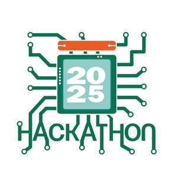

# hack-conf-ai-agents-workshop · Millennial Assistant



Персональный ассистент‑миллениал в n8n: Telegram‑бот, LLM‑агент и Google Sheets как источник правды.
Минимум кода. Быстрый запуск на воркшопе.

## Что это
- Мемный ассистент “миллениал”: кофе, Гарри Поттер, «ПЕЧЕНЬКО», выгорание, ипотека, «спина побаливает».
- n8n‑воркфлоу (`HackConfAIAgent.json`) с Telegram‑триггером, LLM‑агентом и инструментом чтения Google Sheets.
- Готовые тексты: системный промпт и приветствие `/start`.
- Пример таблицы с логами в формате Excel (`google_sheet_millennial_log.xlsx`).


## Состав репозитория
```
HackConfAIAgent.json             # экспорт n8n‑воркфлоу
google_sheet_millennial_log.xlsx # пример Google Sheets (структура и 13 строк)
millennial_system_prompt.md      # системный промпт ассистента
on_start_answer.md               # текст ответа на /start
LICENSE
README.md
```

## Требования
- n8n 1.60+ (или совместимая)
- Подключённые креды в n8n:
  - **Telegram** Bot API
  - **Google Sheets** OAuth2
  - Любой LLM‑провайдер. В примере — **Google Gemini** (`@n8n/n8n-nodes-langchain.lmChatGoogleGemini`). Можно заменить на OpenAI / Ollama / др.
- Доступ к Google‑таблице в домене ваших кредов (только по пользователям, не «по ссылке»).

## Быстрый старт
1) **Создайте таблицу**
   - Откройте `google_sheet_millennial_log.xlsx` и импортируйте в Google Sheets.
   - Лист `Лист1`, колонки:
     ```
     date | time | task | coffee_cups | mood | back_pain | burnout | potter_ref | meme | note
     ```
   - Заполните примерами из файла или своими.
   - Скопируйте `documentId` из URL таблицы (`https://docs.google.com/spreadsheets/d/<documentId>/edit`).

2) **Импортируйте воркфлоу в n8n**
   - `Import from file` → выберите `HackConfAIAgent.json`.
   - Откройте ноду **Google Sheets Tool** и вставьте `documentId` вашей таблицы (и нужный лист).

3) **Подключите креды**
   - В нодах `Telegram Trigger`, `Telegram` укажите ваш Telegram‑бот.
   - В ноде LLM укажите ваш провайдер и ключ.
   - В ноде Google Sheets выберите OAuth‑аккаунт с доступом к таблице.

4) **Активируйте воркфлоу**
   - Запустите воркфлоу в n8n.
   - Напишите боту `/start` в Telegram.

Готово: бот отвечает в стиле «миллениала», а агент может читать строки из Google Sheets как инструмент.

## Поведение ассистента
- Системный промпт: `millennial_system_prompt.md`.
- Приветствие `/start`: `on_start_answer.md`.
- Короткие ответы в живом стиле, 2–3 предложения.
- Агент видит инструмент **Get row(s) in sheet** и может подтягивать последние записи при соответствующем запросе (“покажи последние логи”, “сколько сегодня кофе” и т. п.).

## Команды и примеры
- `/start` — приветствие.
- Любой текст — диалог в стиле мемного миллениала.
- Примеры вопросов:
  - «Как дела?»
  - «Сколько кофе было сегодня?»
  - «Дай сводку по настроению и спине за неделю.»

> Примечание: для агрегаций и сводок лучше добавить отдельную функцию/нод‑скрипт в n8n или подсказки в промпте («считай по последним 10 строкам»).

## Безопасность
- В репозитории нет токенов. Публиковать `documentId` безопасно, **если** таблица не открыта «по ссылке».
- Ограничьте доступ к таблице на конкретные аккаунты.
- Не коммить `.n8n` с чувствительными переменными.

## Замена LLM
- Нет Gemini? Замените ноду на OpenAI/Ollama:
  - Подключите другой `Language Model` в n8n.
  - Оставьте `@n8n/n8n-nodes-langchain.agent` и `memory` без изменений.
  - Системный промпт из `millennial_system_prompt.md` универсален.

## Отладка
- Бот не отвечает: проверьте, что воркфлоу **Active**, и что Telegram‑триггер слушает ваш бот.
- Пустой ответ: проверьте ключи LLM и квоты.
- Нет доступа к таблице: проверьте Google‑аккаунт в кредах и права на Google Sheets.
